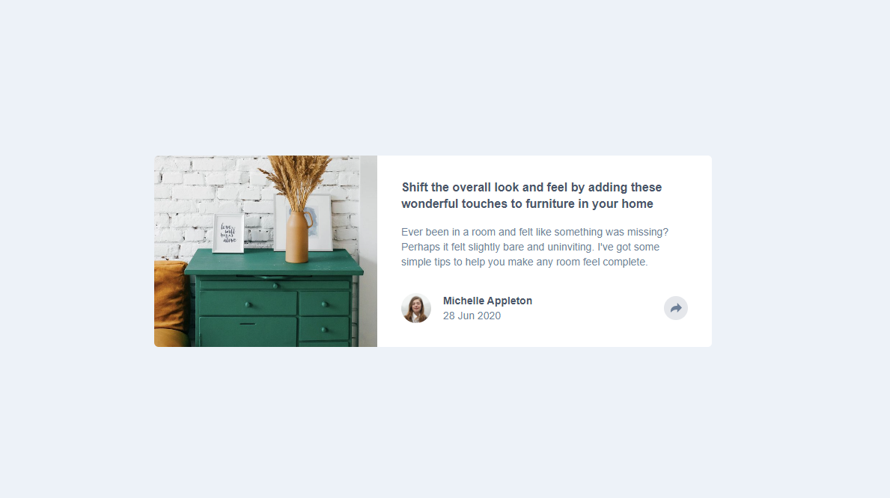
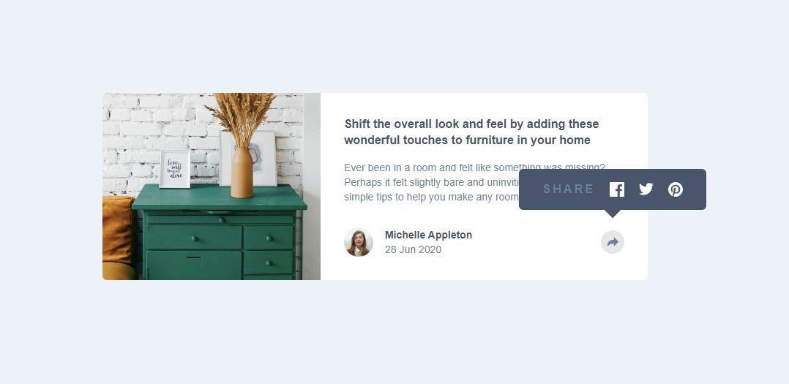
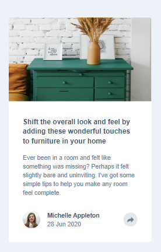
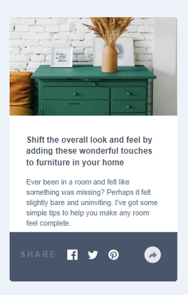

# Frontend Mentor - Article preview component solution

This is a solution to the [Article preview component challenge on Frontend Mentor](https://www.frontendmentor.io/challenges/article-preview-component-dYBN_pYFT). Frontend Mentor challenges help you improve your coding skills by building realistic projects. 

## Table of contents

- [Overview](#overview)
  - [The challenge](#the-challenge)
  - [Screenshot](#screenshot)
  - [Links](#links)
- [My process](#my-process)
  - [Built with](#built-with)
  - [What I learned](#what-i-learned)
  - [Continued development](#continued-development)
  - [Useful resources](#useful-resources)
- [Author](#author)
- [Acknowledgments](#acknowledgments)

**Note: Delete this note and update the table of contents based on what sections you keep.**

## Overview

### The challenge

Users should be able to:

- View the optimal layout for the component depending on their device's screen size
- See the social media share links when they click the share icon

### Screenshot







### Links

- Live Site URL: [Add live site URL here](https://your-live-site-url.com)

## My process

### Built with

- Semantic HTML5 markup
- ReactJs
- [TailwindCSS](https://tailwindcss.com/)
- Mobile-first workflow
- [React](https://reactjs.org/) - JS library


### What I learned

The project was pretty straigh forward until it came time to design the popup which dealt with absolute positioning and some transform utilities such as rotate-45.  At first it was not applying as intended and then realized other classes were taking priority and thus element not rotatin as desired.

After some research I learned that I could customize my own utility classes.  Instead of defining a custom class like rotate-45, I defined a custom utility class using TailwindCSS's @layer directive to ensure it has higher specificity. 

```css
@layer utilities {
  .rotate-45 {
    --tw-rotate: 45deg;
    transform: rotate(var(--tw-rotate));
  }
}
```

### Useful resources

- [Example resource 1](https://www.example.com) - This helped me for XYZ reason. I really liked this pattern and will use it going forward.
- [Example resource 2](https://www.example.com) - This is an amazing article which helped me finally understand XYZ. I'd recommend it to anyone still learning this concept.

## Author

- Website - [My Portfolio](https://ervin-dev.netlify.app/)
- Frontend Mentor - [@yourusername](https://www.frontendmentor.io/profile/yourusername)
- Twitter - [@ervin_dev](https://twitter.com/ervin_dev)
